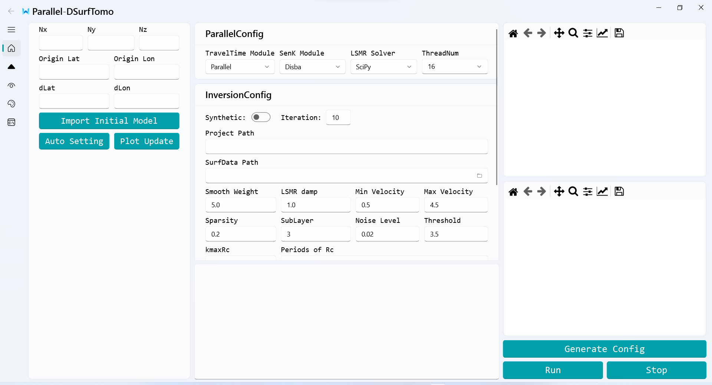
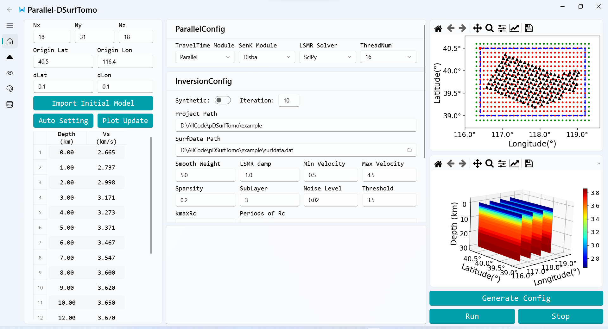
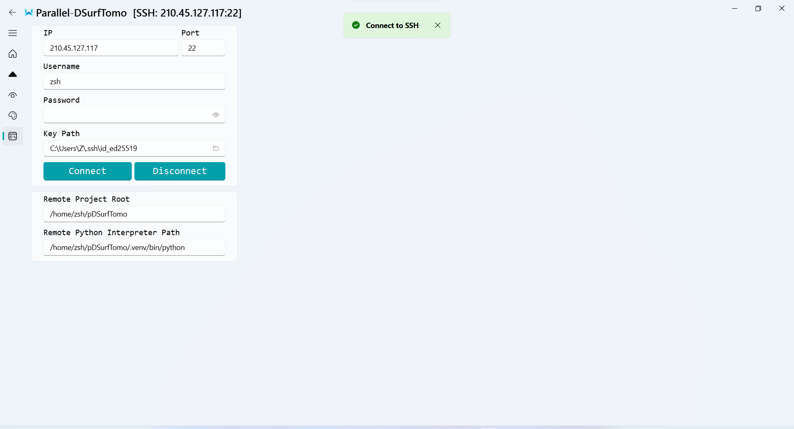
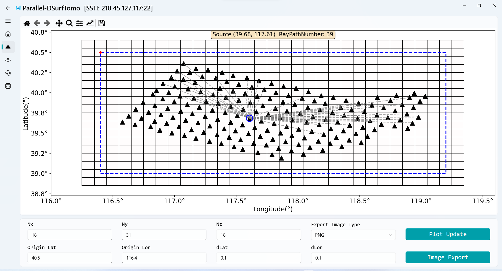
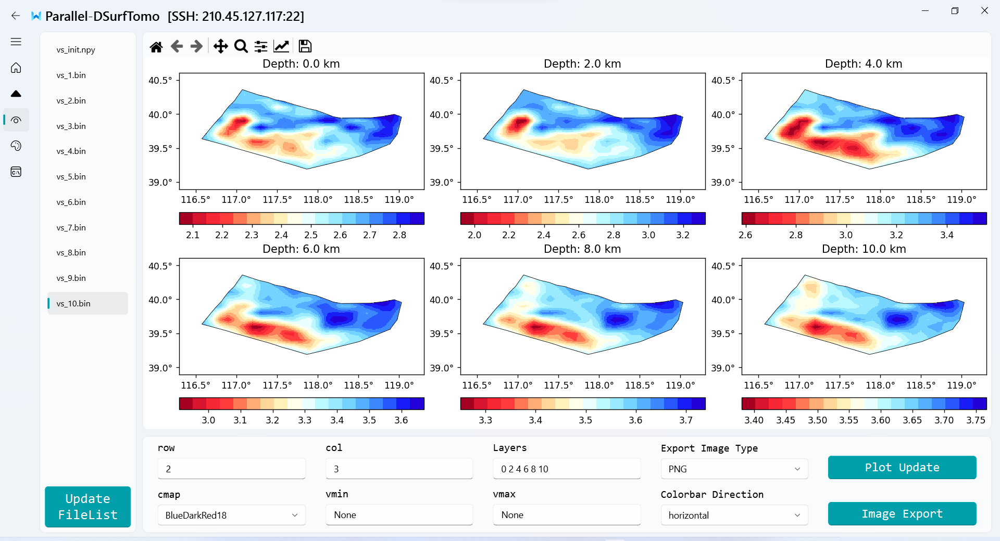
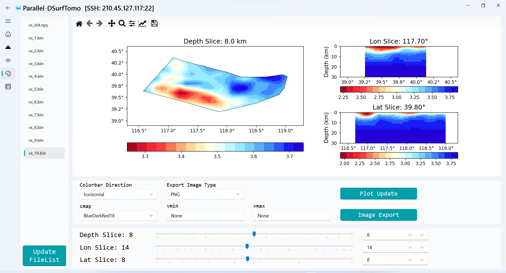

# 1. Introduction
To streamline the inversion workflow, we developed a cross-platform Graphical User Interface (GUI) using Python and PyQt5, ensuring robust compatibility across Windows and Linux environments. A defining feature of this GUI is its seamless remote server connectivity: Users can configure inversion parameters, dispatch computational tasks, and visualize output models on a remote cluster entirely from a local client, effectively eliminating the need for direct command-line interaction. This frontend-backend architecture significantly lowers the technical barrier for large-scale inversions and enhances overall research efficiency.


# 2. Workflow of GUI for pDSurfTomo

## 2.1 Data Preparation

Two prerequisite files must be placed in the same directory before starting: the dispersion data file (`surfdata.dat`) and the model configuration file (`model.json`).


### 2.1.1 Dispersion Data File (`surfdata.dat`)

The dispersion data format is strictly identical to the original DSurfTomo format. Please refer to the [documentation](https://github.com/HongjianFang/DSurfTomo/tree/stable/doc).

```
#  39.635922 116.576990 1 2 0
39.659803 117.090870 3.1450
#  39.436359 117.172720 1 2 0
40.000662 116.952420 1.9950
#  39.712392 116.629650 1 2 0
39.636827 118.073080 2.1600
39.663393 118.829070 2.3700
#  39.620998 116.936110 1 2 0
40.000662 116.952420 2.0700
#  39.541226 117.138160 1 2 0
39.589257 117.286150 1.7650
#  39.416750 117.536280 1 2 0
39.601733 117.550390 2.4000
39.380173 118.514720 2.6000
```


### 2.1.2 Model Configuration File (`model.json`)

- `depth` and `vel_1d`: Represent the depths and corresponding velocities of the 1-D layered shear-wave velocity model. This 1D profile will be horizontally expanded into a 3-D model to serve as the initial velocity model for the inversion.

- `p_Rc`, `p_Rg`, `p_Lc`, `p_Lg`: Represent the periods for Rayleigh wave phase velocity, Rayleigh wave group velocity, Love wave phase velocity, and Love wave group velocity, respectively.

**Note:** If the number of periods for any of these wave types is zero, the corresponding field can be safely omitted from the JSON file. Therefore, the two examples below are functionally equivalent.

```json
{
  "depth": [0.00, 1.00, 2.00, 3.00, 4.00, 5.00],
  "vel_1d": [2.665, 2.737, 2.998, 3.171, 3.273],
  "p_Rc": [1.0, 1.1, 1.2, 1.3, 1.4, 1.5, 1.6, 1.7, 1.8, 1.9, 2.0],
  "p_Rg": [],
  "p_Lc": [],
  "p_Lg": []
}

{
  "depth": [0.00, 1.00, 2.00, 3.00, 4.00, 5.00],
  "vel_1d": [2.665, 2.737, 2.998, 3.171, 3.273],
  "p_Rc": [1.0, 1.1, 1.2, 1.3, 1.4, 1.5, 1.6, 1.7, 1.8, 1.9, 2.0]
}
```


## 2.2 Local Inversion Execution

Launch the GUI by executing the following command in your terminal: `uv run MainWindow.py`




### 2.2.1 Selecting Dispersion Data File

1. Click the file picker icon next to the `SurfData Path` field to select your `surfdata.dat` file. The software will automatically set the project workspace based on this file's location. (**Critical:** Ensure the formatting of `surfdata.dat` is strictly correct.)
2. Click the **Auto Setting** button on the left panel. The software will:
   - Parse `surfdata.dat` to automatically determine the optimal inversion grid parameters.
   - Scan the project workspace for a `model.json` file.
     - If found, it automatically loads the configurations.
     - If not found, you must manually load the `model.json` by clicking both the **Import Initial Model** button on the left and the file picker icon next to the **Periods of Rc** field.
3. Users can further refine the inversion grid parameters and initial velocity model after the automatic setup. Once adjusted, click the **Plot Update** button to refresh the visualization panel on the right.

After executing the steps above, the interface will populate as shown below:




### 2.2.2 Running the Local Inversion Task

1. Adjust the parallel computing settings and inversion parameters as required.
2. Click **Generate Config** to create the configuration files and initial model.
3. Click **Run** to start the inversion task. The standard output will be streamed to the bottom log panel.
4. Click **Stop** to safely terminate the task if necessary.


## 2.3 Remote Inversion Execution

### 2.3.1 Remote Environment Setup

1. Upload the `bin` and `src_pDSurfTomo` directories to your remote server (e.g., `/home/zsh/pDSurfTomo`).

2. Upload the `pyproject.toml` and `uv.lock` files to the same remote directory.

3. Compile the source code on the server:

   ```shell
   cd src_pDSurfTomo
   sh MyMake.sh
   ```

4. Create the Python virtual environment using `uv` and note the absolute path of the generated Python interpreter (e.g., `/home/zsh/pDSurfTomo/.venv/bin/python`):

   ```shell
   uv sync
   ```

5. Ensure your final remote directory structure resembles the following:

   ```shell
   /home/zsh/pDSurfTomo
                      ├── .venv
                      ├── bin
                      ├── src_pDSurfTomo
                      ├── pyproject.toml
                      └── uv.lock
   ```

   

### 2.3.2 Connecting to the Remote Server

1. Navigate to the **SSH Interface**. Input your SSH credentials, along with the `Remote Project Root` and `Remote Python Interpreter Path`.
1. Click **Connect**. The system supports both password and SSH key authentication. For enhanced security and seamless workflow, key-based authentication is highly recommended.




### 2.3.3 Running the Remote Inversion Task

1. Upon a successful connection, the remote project directory will be highlighted in red next to the `Project Path` label.
2. Adjust the parallel computing settings and inversion parameters as required.
3. Click **Generate Config** to create the configuration files and initial model.
4. Click **Run** to start the remote inversion task. The remote standard output will be streamed locally to the bottom log panel.
5. Click **Stop** to terminate the remote task if necessary.


## 2.4 Visualization

### 2.4.1 Visualization of Observation System

- Modify the visualization parameters at the bottom and click **Plot Update** to refresh the rendering:
  - `Nx`, `Ny`, `Nz`: Define the number of grid nodes in the X (Longitude), Y (Latitude), and Z (Depth) directions.
  - `Origin Lat`, `Origin Lon`: Set the geographic coordinates of the grid's origin.
  - `dLat`, `dLon`: Specify the spatial grid spacing in degrees.
- Select your preferred image format and click **Image Export** to save the current plot into the `image` folder within your project directory.

---

- The region enclosed by the **blue dashed bounding box** represents the effective inversion area. (The outermost grid layer serves as a boundary and is excluded from the inversion update).
- The **red dot** marks the origin of the inversion grid, corresponding directly to the `Origin Lat` and `Origin Lon` parameters.
- Black triangles represent seismic stations. Clicking on any station will set it as a virtual source (highlighted with a blue circle) and interactively display the ray paths connecting it to other stations. Additionally, a text box will appear at the top displaying the source coordinates and the total number of valid ray paths.




### 2.4.2 Visualization of MultiSlice

- The left navigation sidebar features an iteration file directory, displaying the model files (e.g., `.bin`, `.npy`) located in the `InvResult` folder. Clicking on any file instantly renders the corresponding iteration's velocity model.
- During an active inversion, the system routinely syncs the remote/local output, and the file list updates automatically. If a manual refresh is required, click the **Update FileList** button anchored below the directory.
- Modify the visualization parameters at the bottom and click **Plot Update** to refresh the rendering:
  - `row` and `col`: Define the grid layout for the subplots
  - `Layers`: Specify the depth indices to be visualized. Input multiple indices separated by spaces (e.g., `0 2 4 6 8 10`). The data extracted corresponds to `vs[:, :, layer_index]`.
  - `cmap`: Specifies the colormap.
  - `vmin` and `vmax`: Control the data range mapping for the colorbars.
  - `Colorbar Direction`: Sets the orientation of the colorbars (horizontal or vertical).
- Select your preferred image format and click **Image Export** to save the current plot into the `image` folder within your project directory.




### 2.4.3 Visualization of Orthogonal Slice

- This interface features three interactive sliders corresponding to the **Depth**, **Longitude**, and **Latitude** slices. Users can dynamically traverse and slice through the 3D velocity volume by dragging the sliders, using the mouse wheel, or adjusting the index positions via the adjacent SpinBoxes.
- Modify the visualization parameters in the control panel and click **Plot Update** to refresh the rendering:
  - `cmap`: Specifies the colormap.
  - `vmin` and `vmax`: Control the data range mapping for the colorbars.
  - `Colorbar Direction`: Sets the orientation of the colorbars (horizontal or vertical).
- Select your preferred image format and click **Image Export** to save the current plot into the `image` folder within your project directory.

