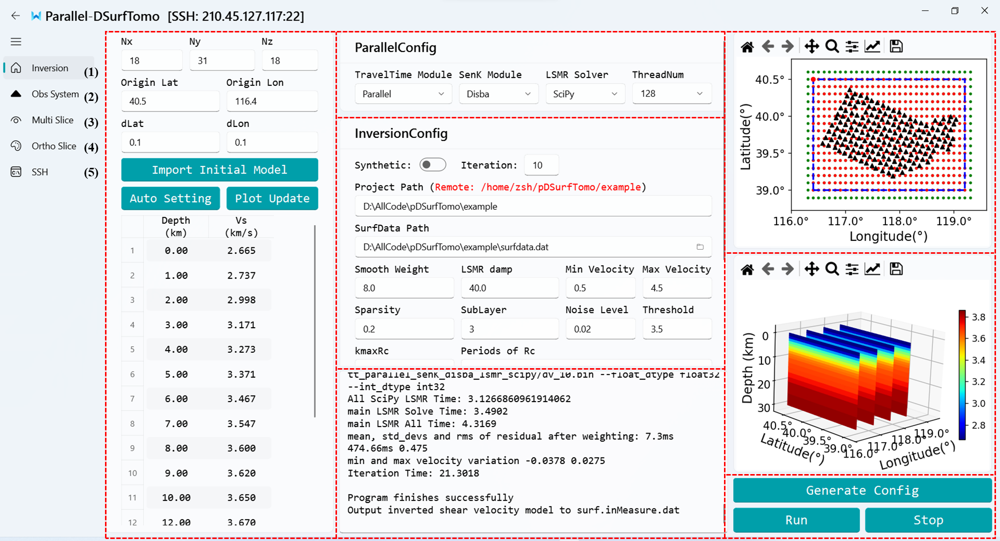
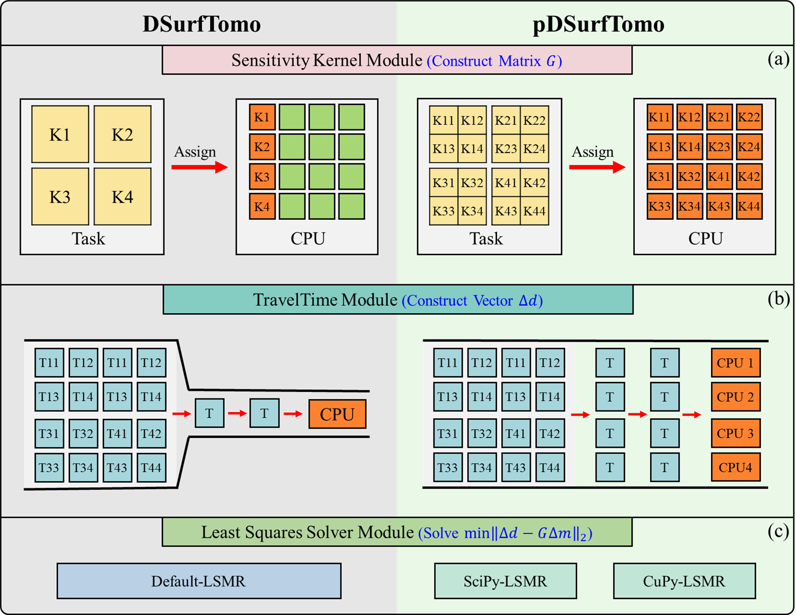

# pDSurfTomo
pDSurfTomo is a high-performance parallel computing package for Direct Surface Wave Tomography, modified from [DSurfTomo](https://github.com/HongjianFang/DSurfTomo). It accelerates the computation by more than 10 times while maintaining a negligible discrepancy compared to the original DSurfTomo. 

To further streamline the workflow, we provide a cross-platform Graphical User Interface (GUI) with remote server connectivity. This allows users to execute and visualize inversion tasks locally while seamlessly utilizing remote computing clusters. 




# Features

Based on the algorithmic structure and computational characteristics, we partitioned the inversion workflow into three primary modules: the Sensitivity Kernel module (SenK), the Traveltime module (TravelTime), and the Least-Squares Solver module (LSMR). 

Additionally, we implemented targeted computational optimizations  within each module.  The architectural evolution of the algorithm, contrasting the original workflow with our proposed framework, is illustrated below. For more details, please refer to our [paper](https://arxiv.org/abs/2604.11920).




# Usage

## Inversion Parameter Configuration
The inversion parameters are completely identical to those in DSurfTomo. Please refer to the [documentation](https://github.com/HongjianFang/DSurfTomo/tree/stable/doc).


## Parallel Parameter Configuration

pDSurfTomo provides different solver schemes for the three modules:

- **SenK:** `Default`, `Parallel`, `Disba`
- **TravelTime:** `Default`, `Parallel`
- **LSMR:** `Default`, `SciPy,` `CuPy`

The parallel configurations of pDSurfTomo are listed below. Users can flexibly choose based on their hardware and requirements:


| Mode | TravelTime |   SenK   |  LSMR   | Description                                                                                                                                                                 | RunTime  |
| :--: | :--------: | :------: | :-----: |:----------------------------------------------------------------------------------------------------------------------------------------------------------------------------| :------: |
|  1   |  Default   | Default  | Default | **Native** Implementation of the original DSurfTomo                                                                                                                         | Baseline |
|  2   |  Parallel  | Parallel | Default | **Parallel** implementation of the original DSurfTomo<br />The inverted velocity model is identical to the original DSurfTomo.                                              |   Fast   |
|  3   |  Parallel  |  Disba   |  SciPy  | **CPU-optimized** implementation of pDSurfTomo.<br />The inverted velocity model maintains a negligible discrepancy ($\approx 10^{-4}$) compared to the original DSurfTomo. |  Faster  |
|  4   |  Parallel  |  Disba   |  CuPy   | **GPU-optimized** implementation of pDSurfTomo.<br />The inverted velocity model maintains a negligible discrepancy ($\approx 10^{-4}$) compared to the original DSurfTomo. | Fastest  |


# Installation

This software has been tested and verified on Windows 11 and Ubuntu 22.04.


## 1. Building from Source

Compile the Fortran source codes. We recommend chaining the commands as follows:

```shell
# Compile DSurfTomo
cd src_DSurfTomo && sh MyMake.sh
cd ..

# Compile pDSurfTomo
cd src_pDSurfTomo && sh MyMake.sh
cd ..
```


## 2. Python Environment Setup

### Install uv

This project leverages `uv` for reliable dependency resolution and environment management. If you encounter any issues, please refer to the [uv installation guide](https://docs.astral.sh/uv/getting-started/installation/).


#### Install for Windows

```powershell
powershell -ExecutionPolicy ByPass -c "irm https://astral.sh/uv/install.ps1 | iex"
```

#### Install for Linux

```shell
curl -LsSf https://astral.sh/uv/install.sh | sh
```


### Resolve Dependencies

After installing `uv`, run the following command in the project root to automatically create a virtual environment and sync all dependencies:

```sh
uv sync
```

**Optional Dependencies:**

- **GPU Acceleration (CuPy):** The `CuPy-LSMR` is pre-configured with `cupy-cuda12x`. Please adjust it in `pyproject.toml` to match your local CUDA Toolkit version. This is an optional dependency and can be safely removed if the GPU-accelerated LSMR solver is not needed. If you encounter any issues, please refer to the [CuPy Installation Guide](https://docs.cupy.dev/en/stable/install.html).
- **Graphical User Interface (GUI):** The GUI is built using `pyqt-fluent-widgets`. This is an optional dependency and can be safely removed if the GUI is not needed. If you encounter any issues, please refer to the [PyQt-Fluent-Widgets Installation Guide](https://qfluentwidgets.com/pages/install/).

After modifying `pyproject.toml`, run `uv sync` to apply the changes.


# Quick Start

## Command Line Interface (CLI)

```shell
# Execute the inversion
python RunExample.py

# Compare the inversion results
python CompareInvResult.py
```


## Graphical User Interface (GUI)

For detailed GUI usage instructions, please refer to [GUI_README.md](GUI/README.md).

```shell
cd GUI
uv run MainWindow.py
```


# Citations

If you use pDSurfTomo in your research, please cite our paper:

Zhu, S., Li, J., Chen, G., Fang, H., & Yao, H. (2026). pDSurfTomo: A High-Performance Parallel Computing Package for Direct Surface Wave Tomography. *arXiv preprint arXiv:2604.11920*.
